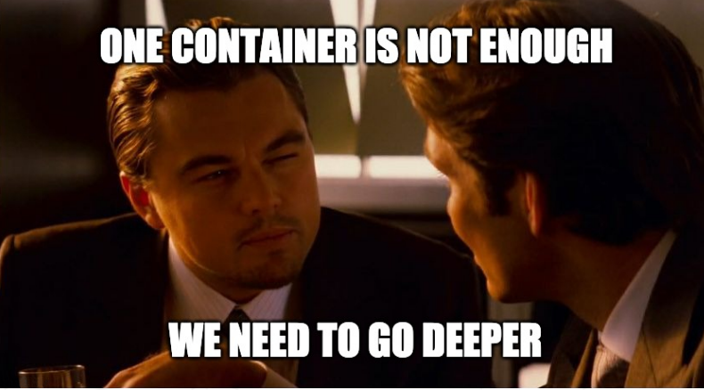

# Inception

School 1337 Project, This project aims to broaden your knowledge of system administration by using Docker.
You will virtualize several Docker images, creating them in your new personal virtual
machine

Set up a small infrastructure composed of WordPress with LEMP Stack (Nginx, MariaDB and PHP) using Docker / Docker-Compose under specific rules.
<br></br>

 <br></br>

## Docker containers

- MariaDB
- WordPress
- Nginx
- Adminer
- Ftp Server
- Backup 
- Redis

## How to use

- Build the images and deploy the infrastructure:

  ```sh
   $ make all
   ```

- Stop and remove containers, remove images, volumes and network:

	```sh
	$ make clean
	```

